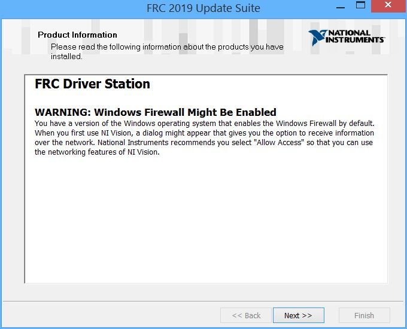
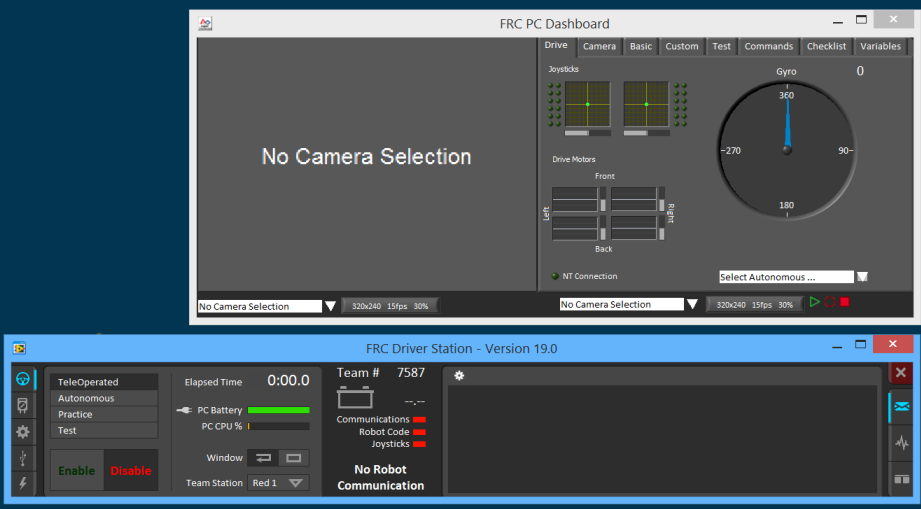
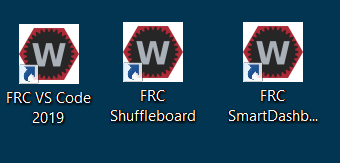

# Environment Setup
A set of software components must be installed on the laptop, which is to be the Driver Station of your robot. Make sure you have a stable and decent Internet connection.

## FRC Update Suite by NI ([National Instruments](http://www.ni.com))
National Instruments provides the Driver Station and tools for imaging the roboRIO. Installation is straighforward but you'll need to log onto <ni.com> and provide license serial number.

1. Go to http://www.ni.com/download/first-robotics-software-2017/7904/en/, and click the link **FRCUpdateSuite_2019.2.0.zip**.
2. You'll be prompted to log in, create an account if needed.
3. After downloaded, unzip the zip file to a local folder, go into the folder and double-click **setup.exe** to start installation.

On most of the installation wizard screens you click "Next" to move along. Pay attention to a few screens below:

Enter Team7587's license activation code **B04P65237** on this window:

Ensure to accept 2 license agreements:

Note the warning on Windows firewall, and make sure you pick "Allow Access" whenever prompted:

**IMPORTANT:** Make sure you tick the checkbox to run license manager at the end of installation:

When license manager starts, if you already logged in on the ni.com site, it's most likely that the serial number you entered above is already populated; if not, just enter it again, then click the 'Activate' button:

After activating the license, restart the laptop as prompted. After reboot, you should see below three tools on your desktop:

* Driver Station
* FRC Dashboard
* roboRIO Imaging Tool

### Driver Station
The Driver Station (DS) is a critical part of your robot software. It is the user interface on your laptop that enables you to communicate with the robot, and **drive** it. Now you should launch the DS and inspect its various components.

By default, DS launches itself plus the default Dashboard:

Read the article [FRC Driver Station](https://wpilib.screenstepslive.com/s/currentCS/m/driver_station/c/86704) as you move along.

~~~
Tip: Connect your joystick and game pad to the laptop and see if DS detects them.
~~~  

## FRC Development Tools by WPI
In 2019 WPI deprecated Eclipse and started pushing **Visual Studio Code** (a light-weight development tool by [Microsoft](https://code.visualstudio.com/)) as the new standard IDE.

>**Note:** The WPI package installer contains a specific JDK version (v11), do not use any JDK outside of the installed package.

- Go to [https://github.com/wpilibsuite/allwpilib/releases](https://github.com/wpilibsuite/allwpilib/releases) and download the latest version; at this point it's either **WPILibInstaller_Windows64-2019.4.1.zip** (for 64-bit Windows) or **WPILibInstaller_Windows32-2019.4.1.zip** (for 32-bit Windows). The file is over 1 GB, it will take some time.

>**Note:** To determine your Windows version, go to **Control Panel** and open **System**, look for "System type" field.

- Extract the .exe file in the zip and double-click it to start the installation.

- The installer will initially have the two checkboxes "*Visual Studio Code*" and "*Visual Studio Code Extensions*" disabled (see below). You need to click "**Select/Download VS Code**" to download it first. The downloaded file is **OfflineVsCodeFiles-1.3x.1.zip** and will be placed in the same folder as the installer. Leave it there and don't open it.

- Back on WPILib Installer, check the two "*Visual Studio Code...*" checkboxes, and click "*Execute Install*" to start the full installation. After a while you'll get a prompt confirming the installation is completed, and see below three icons placed on the desktop.

- Double-click the icon "**FRC VS Code 2019**" to launch the IDE, type ***Ctrl+Shift+P***. A command pallet shows up on the top, type in "*WPILIb*" and you should see a list of WPILib commands show up.

>**Note:** The installer places all the files in the folder **C:\Users\Public\frc2019**, this way all users on the laptop can access them.

### 3. Phoenix Framework by CTRE ([Cross The Road Electronics](http://www.ctr-electronics.com/))
In order to use the **Talon SRX** motor controller, the **Phoenix Software Package** from its manufacturer CTRE is required. Installation is straightforward:
1. Visit http://www.ctr-electronics.com/hro.html#product_tabs_technical_resources
2. Click the link **CTRE Phoenix Framework Installer 5.15.0.1 (.zip)** to download the zip package
3. The zip file contains a single file with same name but .exe extension, extract it out to local folder
4. Double-click it to start the installation (it will require admin rights)
5. If you see below alert window, click 'Install' to continue:

After installation completes, the Phoenix Tuner icon shows up on your desktop:

Launch the tuner and it would look like this:

> More information on Phoenix Software can be found [here](https://phoenix-documentation.readthedocs.io/en/latest/ch03_PrimerPhoenixSoft.html#what-is-phoenix-tuner).
>

Now that your environment is up, let's move on to take a closer look at the basics of robot programming.
