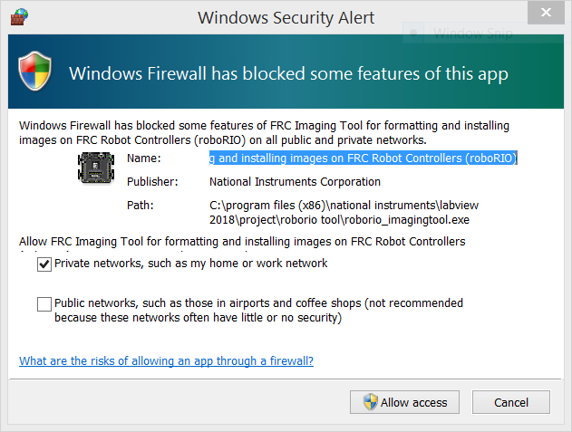

# roboRIO Setup
Just as you need to format and install an Operating System on a new hard drive, the roboRIO needs to be "*initialized*" (or *flashed*). This is done by using the **roboRIO Imaging Tool**.

> **Note:** You must use a Type A-B USB cable to connect your laptop to the roboRIO to perform the imaging.

### Imaging your roboRIO

Follow through this detailed [**instruction**](https://wpilib.screenstepslive.com/s/currentCS/m/getting_started/l/1009233-imaging-your-roborio) on WPI site. Note that running the tool requires administrator rights.

**Windows Firewall Issue**

During imaging process the Windows firewall should be turned off. We recommend you do this first before starting the imaging process. Instruction can be found on WPI site [here](https://wpilib.screenstepslive.com/s/currentCS/m/troubleshooting/l/284356-windows-firewall-configuration).

In case you are prompted with following alert, simply click **Allow Access** to proceed.

### Verify Driver Station Connectivity

(coming soon...)
