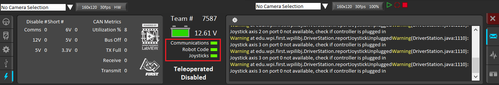
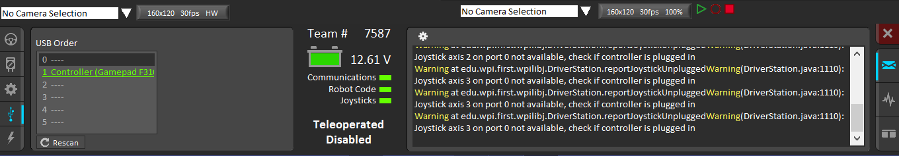
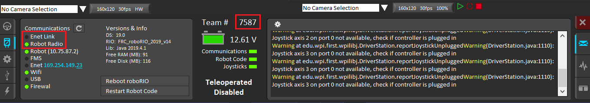
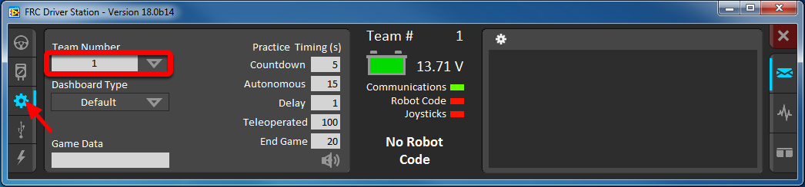
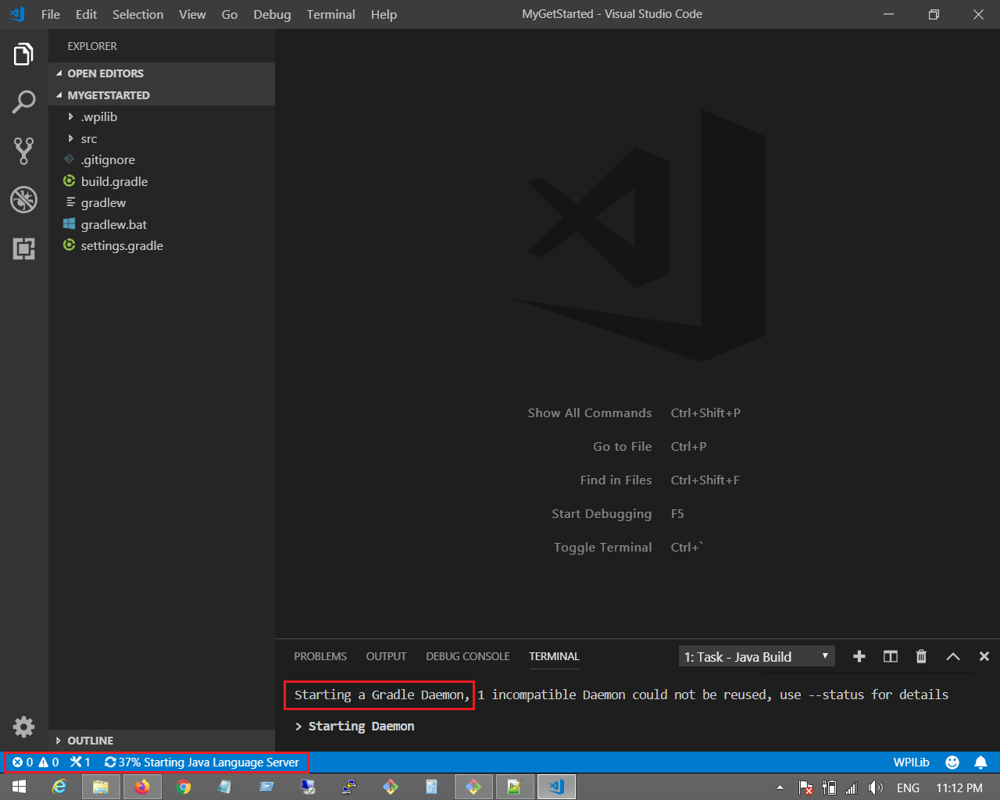
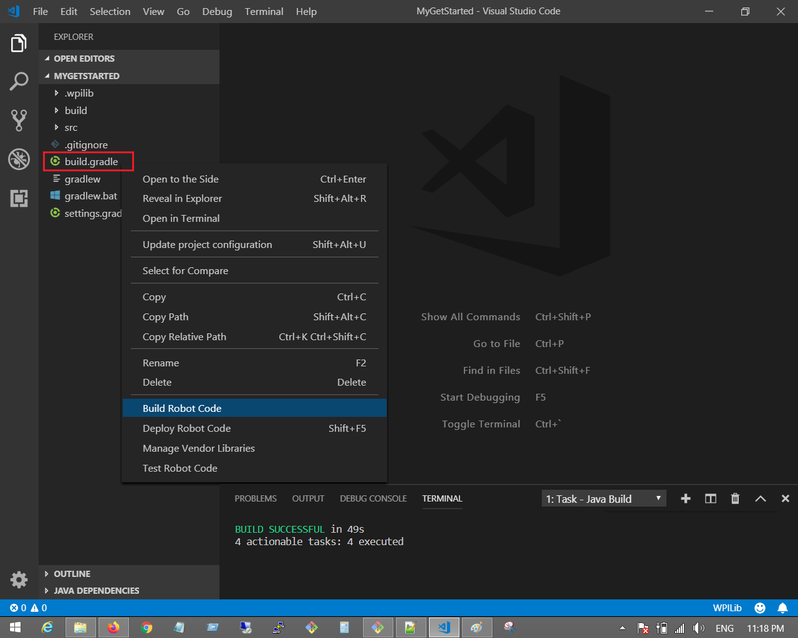
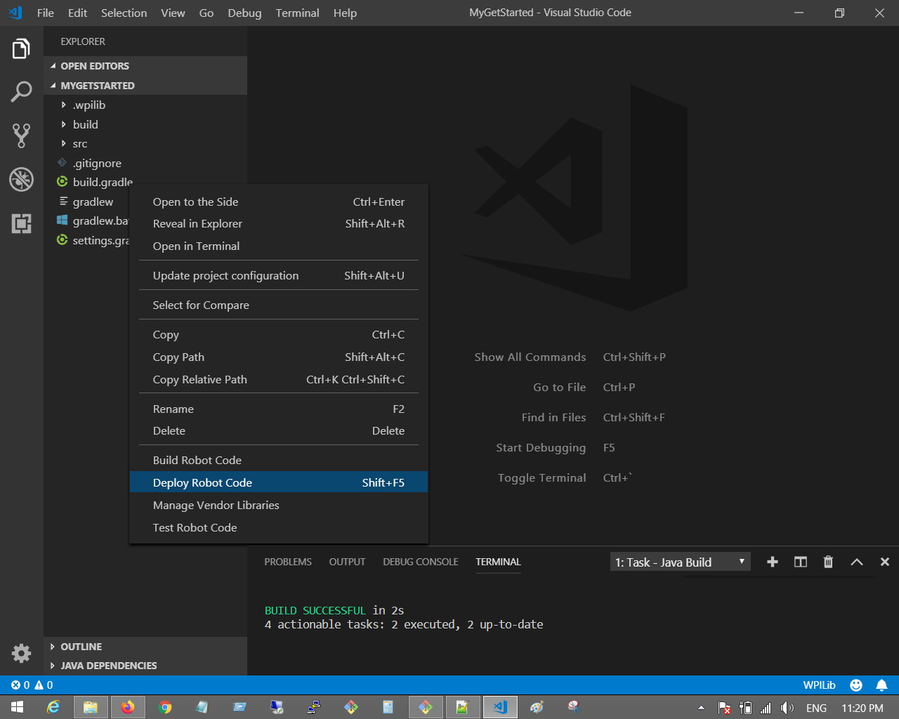

# Your First Robot Program
Now that you have set up your development environment, it's time to try connecting your laptop to the roboRIO, and create your first (test) robot program!

## Driver Station Connectivity
At minimum, you'll need to connect the following components on the robot electrical board:

**Battery -> Power breaker -> PDP -> RoboRIO**

Now connect your laptop to the roboRio using USB or Ethernet cable, and launch the Driver Station. You should see below on the Driver Station interface:

Note the three fields underneath the battery idcon are green. If you don't have robot code pushed yet, or no joystick connected to the laptop, those fields would be red.

Here's the screenshot showing joystick connected:

Click the diagnostics button on the DS panel, you expect to see either "Enet Link" (via Ethernet cable) or "Robot Radio" (via Wifi) in green, depending on the way the laptop is connected to the roboRIO:

>**Note:** You need to enter Team number on DS matching the number entered when you image the roboRIO using NI Imaging Tool.

## Create Project in VSCode
The new [frc-doc](https://docs.wpilib.org/en/latest) site has a great guide to create a benchtop test program. Do follow the steps there to learn how to create the Java project in VS Code:

**[Create BenchTop Test Program](https://docs.wpilib.org/en/latest/docs/getting-started/running-a-benchtop/creating-benchtop-test-program-cpp-java.html)**

## Deploy to roboRIO
After completing the new project wizard decribed above, you will see VS Code setting up gradle build for the first time, which may take a bit of time:

At the end you should see the message "BUILD SUCCESSFUL" on the VS Code terminal window:

The project is ready to be worked on now. 

For the purpose of running the test program, you don't need to make any change, just right-click the **build.gradle** file in the projet navigation panel, then choose "Build Robot Code" to build the project:

After project is built successfully, right-click build.gradle again and now choose "Deploy Robot Code". This will deploy the built Java program (typically a .jar file) to robotRIO:

## Go Robot!
If all goes well by now, you should be able to drive the robot using your first robot program! The chapter right after the "Creating BenchTop Test Program" shows you how to do this:

**[Running your Benchtop Test Program](https://docs.wpilib.org/en/latest/docs/getting-started/running-a-benchtop/running-benchtop-test.html)**

